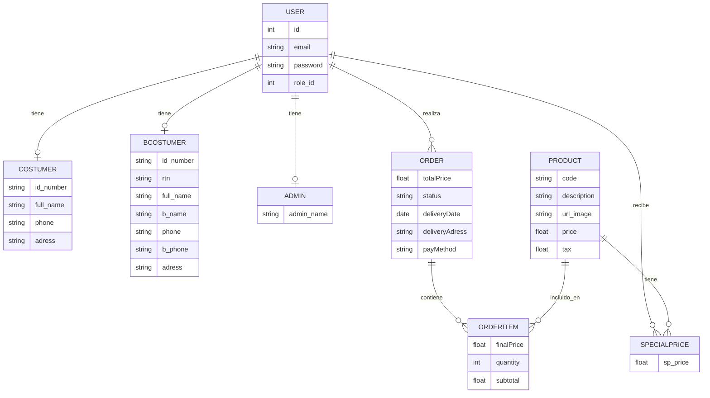

# Mimos Backend


API REST para la app móvil de **Mimos**, un flujo de compra digital con catálogo de productos, precios especiales por cliente y gestión de pedidos, para clientes particulares, clientes empresariales y administradores.

## Tabla de contenidos

- [Descripción general](#descripción-general)
- [Stack tecnológico](#stack-tecnológico)
- [Funcionalidades](#funcionalidades)
- [Modelo de datos](#modelo-de-datos)
- [Estructura del proyecto](#estructura-del-proyecto)
- [Endpoints de la API](#endpoints-de-la-api)
- [Instalación](#instalación)
- [Configuración de base de datos](#configuración-de-base-de-datos)


---

## Descripción general

Mimos Backend centraliza la lógica de negocio de la plataforma Mimos y expone una API REST para que la app móvil pueda autenticar usuarios, consultar el catálogo, aplicar precios especiales y registrar pedidos.

El backend está pensado para tres tipos de usuario:

| Rol | Descripción |
|---|---|
| Cliente | Usuario particular que compra en la app |
| Cliente empresarial | Cliente con acceso a precios especiales por producto |
| Administrador | Gestiona catálogo, usuarios y pedidos |

### Flujo típico de compra

1. El usuario inicia sesión y recibe un JWT.
2. La app consulta el catálogo de productos.
3. Si es cliente empresarial, se aplican sus precios especiales.
4. El cliente genera una orden con uno o más productos.
5. La API guarda la orden y sus líneas de detalle (`OrderItem`).
6. El administrador puede consultar el historial de pedidos.

## Stack tecnológico

- **Node.js** + **Express.js** — servidor y enrutamiento
- **Sequelize ORM** sobre **MySQL** — modelado y acceso a datos
- **JWT** — autenticación por token
- **CORS**, **body-parser**

La lógica está organizada por rutas → controladores → modelos, con transacciones de Sequelize en las operaciones críticas (por ejemplo, creación de órdenes con sus items).

## Funcionalidades

### Usuarios

Cada usuario tiene una cuenta base en `User` y, según su `role_id`, un perfil complementario en `Costumer`, `BCostumer` o `Admin`. Esto separa la identidad del usuario de los datos específicos de cada tipo de perfil.

### Autenticación

Login por email y contraseña. El backend valida credenciales y firma un JWT con `id` y `role_id`, con expiración de 24 horas.

### Catálogo de productos

CRUD completo de productos (código, descripción, imagen, precio, impuesto).

### Precios especiales

Un cliente empresarial puede tener un precio distinto para un producto específico, mediante la relación `User` – `Product` – `SpecialPrice`. Soporta creación individual y en lote.

### Pedidos

Registro de órdenes completas: total, estado, fecha y dirección de entrega, método de pago, y sus líneas de detalle (`OrderItem`) con producto, precio final, cantidad y subtotal.

## Modelo de datos



## Estructura del proyecto

```text
Mimos_Backend/
├── config/
│   └── config.json
├── migrations/
├── models/
│   ├── admin.js
│   ├── bcostumer.js
│   ├── costumer.js
│   ├── index.js
│   ├── order.js
│   ├── orderitem.js
│   ├── product.js
│   ├── role.js
│   ├── specialprice.js
│   └── user.js
├── src/
│   ├── controllers/
│   │   ├── loginController.js
│   │   ├── orderController.js
│   │   ├── productController.js
│   │   ├── specialController.js
│   │   └── userController.js
│   ├── middlewares/
│   │   └── autenticacion.js
│   ├── routes/
│   │   ├── loginRoute.js
│   │   ├── orderRoutes.js
│   │   ├── productRoutes.js
│   │   ├── specialRoutes.js
│   │   └── userRoutes.js
│   └── services/
│       └── services.js
├── package.json
├── server.js
└── vercel.json
```

## Endpoints de la API

### Autenticación

| Método | Ruta | Descripción |
|---|---|---|
| POST | `/users/login` | Autentica y devuelve un JWT |

```json
// POST /users/login
{
  "email": "cliente@correo.com",
  "password": "123456"
}
```

```json
// Respuesta
{
  "token": "jwt_token_here"
}
```

### Usuarios

| Método | Ruta | Descripción |
|---|---|---|
| GET | `/users` | Lista todos los usuarios con su perfil asociado |
| GET | `/users/:id` | Obtiene un usuario por ID |
| POST | `/users` | Crea un usuario y su perfil (`role_id`: 1 = Costumer, 2 = BCostumer, 3 = Admin) |
| PUT | `/users/:id` | Actualiza usuario y perfil |
| DELETE | `/users/:id` | Elimina un usuario y sus registros dependientes |

### Productos

| Método | Ruta | Descripción |
|---|---|---|
| GET | `/products` | Lista productos |
| GET | `/products/:id` | Obtiene un producto por ID |
| POST | `/products` | Crea un producto |
| PUT | `/products/:id` | Actualiza un producto |
| DELETE | `/products/:id` | Elimina un producto |

### Pedidos

| Método | Ruta | Descripción |
|---|---|---|
| POST | `/orders` | Crea una orden con sus items |
| GET | `/orders/user/:userId` | Pedidos de un usuario |
| GET | `/orders/:orderId` | Obtiene una orden específica |
| GET | `/orders` | Lista todas las órdenes |
| DELETE | `/orders/:orderId` | Elimina una orden y sus líneas |

```json
// POST /orders
{
  "userId": 1,
  "totalPrice": 129.99,
  "status": "pending",
  "deliveryDate": "2026-09-01",
  "deliveryAdress": "Col. Los Pinos, Tegucigalpa",
  "payMethod": "cash",
  "items": [
    {
      "productId": 2,
      "finalPrice": 59.99,
      "quantity": 2,
      "subtotal": 119.98
    }
  ]
}
```

### Precios especiales

| Método | Ruta | Descripción |
|---|---|---|
| POST | `/specials` | Crea un precio especial |
| POST | `/specials/bulk` | Crea precios especiales en lote |
| GET | `/specials/user/:businessCustomerId` | Precios especiales de un cliente empresarial |

## Instalación

**Requisitos:** Node.js 18+, MySQL, npm

```bash
git clone https://github.com/tuusuario/Mimos_Backend.git
cd Mimos_Backend
npm install
```

Configura la base de datos en `config/config.json` y luego:

```bash
npm start
```

El servidor inicia en el puerto `3000` por defecto y sincroniza los modelos con la base de datos mediante `sequelize.sync()`.

## Configuración de base de datos

```json
{
  "development": {
    "username": "root",
    "password": "tu_password",
    "database": "mimos_db",
    "host": "localhost",
    "dialect": "mysql"
  }
}
```


---

## Licencia

Distribuido bajo la licencia ISC.
